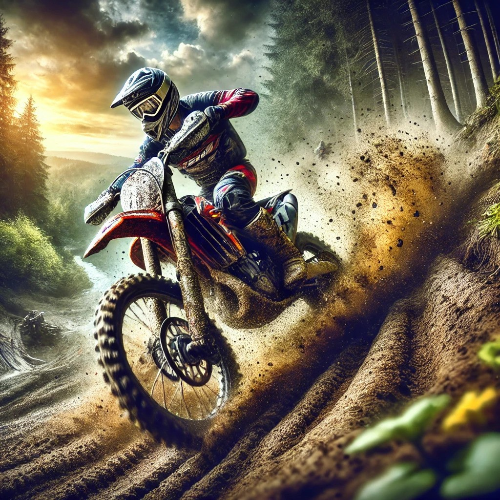

<html lang="en">
<head>
    <meta charset="UTF-8">
    <meta name="viewport" content="width=device-width, initial-scale=1.0">
    <title>My Journey in Tech and Beyond</title>
    
</head>
<body>
    <h1>Welcome to My Journey in Tech and Beyond</h1>
    
    

        
Hi! I'm an aspiring student with a deep passion for technology and a drive to learn and grow in the field of software development. My primary focus right now is on mastering Java, a language that has captivated my interest due to its versatility and widespread use in various domains such as web development, mobile applications, and large-scale enterprise systems.

        
Beyond the world of coding, I have a keen interest in dirt biking. The thrill of speeding through rugged terrains on a dirt bike is unmatched, and it's one of the ways I balance my passion for technology with a love for the outdoors. These activities not only challenge me physically but also teach me discipline, focus, and perseverance—traits that are equally valuable in the tech world. Fr fr ong

    

    

        
        
        
    

    

        <h2>My Projects and Aspirations</h2>
        
As I delve deeper into Java programming, I have a few exciting projects lined up that I am eager to start:

        <ul>
            <li><strong>Java Game Development:</strong> I'm interested in creating a simple 2D game using Java, focusing on understanding the fundamentals of game loops, collision detection, and sprite animations.</li>
            <li><strong>Web Development with Java:</strong> Building a full-stack web application using Java Spring Boot for the backend and integrating it with modern front-end technologies.</li>
            <li><strong>Android App Development:</strong> Exploring the world of mobile app development by building an Android application that solves real-world problems, possibly in the area of productivity or fitness.</li>
        </ul>
        
These projects not only aim to enhance my coding skills but also serve as a portfolio to showcase my abilities as I work towards becoming a proficient software developer.

        
On the weekends, when I'm not coding, you can find me out on the trails with my dirt bike, exploring new paths and pushing the limits of both my bike and myself. Just like coding, dirt biking requires a mix of skill, strategy, and constant learning, making it an ideal hobby that complements my tech journey.

    

</body>
</html>

<body>
    <h1>Rock, Paper, Scissors Game</h1>
    
Choose your move:

    <button onclick="playGame('rock')">Rock</button>
    <button onclick="playGame('paper')">Paper</button>
    <button onclick="playGame('scissors')">Scissors</button>
    

    
</body>

   
